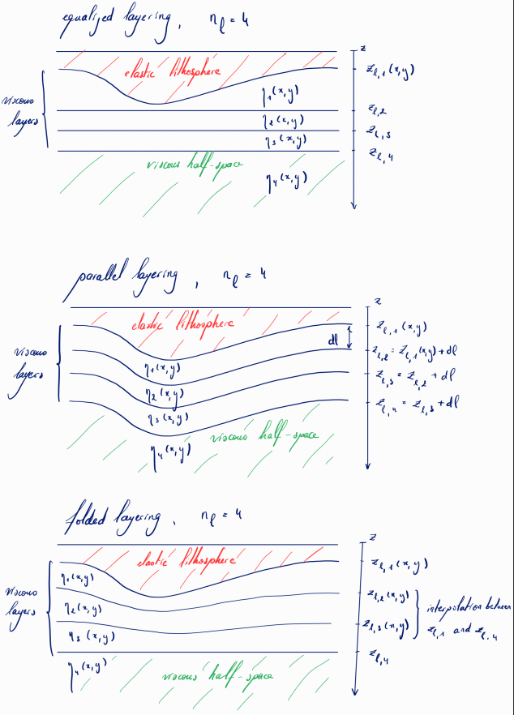

# FastIsostasy

FastIsostasy is a model that regionally computes the glacial isostatic adjustment (GIA), as described in [Swierczek-Jereczek et al. (2024)](https://gmd.copernicus.org/articles/17/5263/2024/). It approximates the gravitational response, accounts for the resulting heterogeneity of the sea-surface height and computes the evolution of masks (continent, ocean, floating ice, grounded ice), as well as the load anomalies applied upon the solid Earth. The resulting bedrock deformation can be computed with different models:

1. Local lithosphere, relaxed asthenosphere (LLRA).
2. Elastic lithosphere, relaxed asthenosphere (ELRA; LeMeur and Huybrechts, 1996).
3. Elastic lithosphere, relaxed astenosphere (ELVA; Cathles, 1975; Lingle and Clark, 1985; Bueler et al., 2007).
4. Laterally-Variable ELVA (LV-ELVA; Swierczek-Jereczek et al., 2024).

If you are interested in coupling FastIsostasy to your ice-sheet model, the remainder of the README.md is for you! It provides the initial steps to get started with FastIsostasy (stand-alone) and the few lines of fortran code needed for a correct interaction with an ice sheet model.

If compatible with your research ecosystem, you should preferably use the [Julia implementation](https://github.com/JanJereczek/FastIsostasy.jl), which offers extend capabilities (GPU acceleration, higher-order time integration schemes, adaptive time stepping). 

## Getting started (stand-alone)

1. Define a configuration file for your system and compiler within the folder `config`. Use a previously existing config file as a template. For the remainder of these instructions, we will assume that the config file is `config/pik_hpc2024_ifx`.

2. Generate a Makefile using the `config.py` script:

    ```
    python config.py config/pik_hpc2024_ifx
    ```

3. Compile the test program

    ```
    make test_isostasy
    ```

    You can choose which test should be performed by setting `experiment` (defined in `test_isostasy.f90`) accordingly.

4. (Optional) If you want to run more complex simulations (e.g. Test 4), you will need additional data (ice loading history, parameter fields, etc.), which can be downloaded via:

    ```
    git clone https://github.com/JanJereczek/isostasy_data.git
    git clone git@github.com:JanJereczek/isostasy_data.git      # if you are using ssh
    ```

    If you already downloaded `isostasy_data`, make a symbolic link to it:

    ```
    ln -s path_to/isostasy_data
    ```

5. Run the test program

    ```
    ./libisostasy/bin/test_isostasy.x 
    ```

The output directory is hard-coded to `output/` for now. When the program runs successfully, the model output will be saved in the file `output/bedtest_x.nc`, with `x` the experiment number associated with the parameters `par/test_isostasy_testx.nml`.

That's it!

## Test details

### Test 1

Reproducing the idealised load experiment from Bueler et al. (2007) with `isos.include_elastic = .false.` and :
1. `isostasy.method = 0`
2. `isostasy.method = 1`
3. `isostasy.method = 2`
4. `isostasy.method = 3` one layer for mantle
5. `isostasy.method = 3` two layers for mantle + `isostasy.lumping = "freqdomain`.

### Test 2

Reproducing 1D GIA benchmark from Spada et al. (2011) with elastic displacement, viscous diplacement = ELVA, and:

1. `isostasy.lumping = "max"`
2. `isostasy.lumping = "min"`
3. `isostasy.lumping = "freqdomain"`

### Test 3

Reproducing 3D GIA benchmark from Swierczek-Jereczek et al. (2024) with:
1. `isostasy.mantle = "uniform"`; `isostasy.lithosphere = "gaussian_minus` (lithosphere thins towards the center of the domain following a Gaussian)
2. `isostasy.mantle = "uniform"`; `isostasy.lithosphere = "gaussian_plus`
3. `isostasy.mantle = "gaussian_minus"`; `isostasy.lithosphere = "uniform`
4. `isostasy.mantle = "gaussian_plus"`; `isostasy.lithosphere = "uniform`

### Test 4

Reproducing glacial cycle with interactive sea level and:
1. `barysealevel.method = "fastiso"`
2. `barysealevel.method = "mixed"`

### Test 5

Greenland simulation of ice thickening and:
1. `isostasy.method = 2`
2. `isostasy.method = 3` one layer for mantle
3. `isostasy.method = 3` two layers for mantle + `isostasy.lumping = "freqdomain`.


## Coupling FastIsostasy to your favorite ice-sheet model

Coupling FastIsostasy requires the following important steps:
- initialize an instance `isos_i` of the `isostasy_class` for each ice domain with index `i`,
- initialize a single instance `bsl` of `bsl_class`, which will handle the barystatic sea level across the domains,
- initialize the state of `isos_i` and `bsl`,
- update the state of`isos_i` and `bsl` within your time loop.

In the following, we refer to the working precision (simple or double) by `wp`. The fortran code corresponding to the aforementioned steps is:

```
! ...
! insert your own code here
! ...

type(isos_class)        :: isos_1       ! isostasy domain 1; e.g. Greenland
type(isos_class)        :: isos_2       ! isostasy domain 2; e.g. Antarctica
type(bsl_class)         :: bsl          ! accounts bsl contributions of all isostasy domains
character(len=512)      :: path_par_1   ! parameter file (*.nml) of domain 1
character(len=512)      :: path_par_2   ! parameter file (*.nml) of domain 2

integer                 :: nx_1, ny_1   ! number of grid points of ice domain 1
integer                 :: nx_2, ny_2   ! number of grid points of ice domain 2
real(wp)                :: dx_1, dy_1   ! resolution of ice domain 1
real(wp)                :: dx_2, dy_2   ! resolution of ice domain 2
real(wp)                :: time         ! the model time

real(wp), allocatable   :: z_bed_1(:, :)! topography of domain 1
real(wp), allocatable   :: z_bed_2      ! topography of domain 2
real(wp), allocatable   :: z_bed_ref_1  ! reference topography of domain 1
real(wp), allocatable   :: z_bed_ref_2  ! reference topography of domain 1
real(wp), allocatable   :: H_ice_1      ! ice thickness of domain 1
real(wp), allocatable   :: H_ice_2      ! ice thickness of domain 2
real(wp), allocatable   :: H_ice_ref_1  ! reference ice thickness of domain 1
real(wp), allocatable   :: H_ice_ref_2  ! reference ice thickness of domain 2

character(len=256)      :: file_isos_restart_1  ! path to write restart of isos domain 1
character(len=256)      :: file_isos_restart_2  ! path to write restart of isos domain 2


! ...
! insert your own code here
! ...

call bsl_init(bsl, path_par)
call isos_init(isos_1, path_par, "isos", nx_1, ny_1, dx_1, dy_1)
call isos_init(isos_2, path_par, "isos", nx_2, ny_2, dx_2, dy_2)

call bsl_update(bsl)    ! optionally provide: year_bp=time_bp

call isos_init_ref(isos_1, z_bed_ref_1, H_ice_ref_1)
call isos_init_state(isos_1, z_bed_1, H_ice_1, time, bsl)

call isos_init_ref(isos_2, z_bed_ref_2, H_ice_ref_2)
call isos_init_state(isos_2, z_bed_2, H_ice_2, time, bsl)

do time = 1, nt

    ! ...
    ! insert your own code here
    ! ...

    call bsl_update(bsl, time)

    call isos_update(isos_1, H_ice_1, time, bsl)
    z_bed_1 = isos_1%out%z_bed
    z_ss_1  = isos_1%out%z_ss
    maskgrounded_1 = isos_1%out%maskgrounded
    maskcontinent_1 = isos_1%out%maskcontinent
    maskocean_1 = isos_1%out%maskocean

    call isos_update(isos_2, H_ice_2, time, bsl)
    z_bed_2 = isos_2%out%z_bed
    z_ss_2  = isos_2%out%z_ss
    maskgrounded_2 = isos_2%out%maskgrounded
    maskcontinent_2 = isos_2%out%maskcontinent
    maskocean_2 = isos_2%out%maskocean

    ! ...
    ! insert your own code here
    ! ...

end do

call isos_restart_write(isos_1, file_isos_restart_1, time)
call isos_restart_write(isos_2, file_isos_restart_2, time)

! ...
! insert your own code here
! ...

```

The code above examplifies the coupling structure with two ice domains and, following the same structure, an arbitrary number of domains can be treated. For most users however, only a single domain is needed and the code can be used by simply deleting all operations related to domain2.

## Options

FastIsostasy presents options that can be chosen through the parameter namelist. Although the templates provided in `/par/test_isostasy_testx.nml` are commented, we provide a more detailled descriptions of the important options here. Rather than strictly following the order of the namelist, we start with the options that are relevant to most users and end with options that represent edge cases.

### Barystatic sea level

The barystatic sea level (BSL) is the global mean sea level (GMSL) when only accounting for volumetric changes of the ice sheets and ignoring additional effects (e.g. steric contributions). The user can choose to:

1. keep BSL constant over time,
2. vary BSL over time according to an input file,
3. vary BSL over time according to the contributions of each isostasy domain.

For instance, paleosimulations are best performed with option 2, which accepts BSL reconstructions as an input. In contrast, future projections are best performed with option 3, which allows to modify the BSL in accordance with the state of the ice sheets.

Option 3 additionally allows varying the ocean surface over time if the user provides `A_ocean_path = path_to_file.nc`, where `z` and `A` should be defined as the vectors containing the BSL and the corresponding ocean surface, respectively. Accounting for this effect has a (second order) importance for large changes in the BSL. For instance, at LGM, the ocean surface was reduced by about 7% due to a BSL that was about 130 meters lower than today.

### Heterogeneous and interactive sea level

Gravitational perturbation arise when an ice sheet grows or shrinks and lead to a spatially heterogeneous sea surface height (SSH). To account for this, choose `heterogeneous_ssh = .true.`.

Changes in BSL and SSH lead to a change of the water column height, which leads to a change of the surface load and therefore has an impact on the bedrock deformation. This can be ccounted for by choosing `interactive_sealevel = .true.`. Note: most regional isostasy models published to date (end 2024) do not account for this!

### Choice of deformational module

Through the choice of `method`, the user can choose to:

1. deactivate bedrock deformation,
2. compute it according to LLRA (local lithosphere, relaxed asthenosphere),
3. compute it according to ELRA (elastic lithosphere, relaxed asthenosphere),
4. compute it according to LV-ELVA (laterally-variable elastic lithosphere, viscous asthenosphere).

LV-ELVA was presented in [Swierczek-Jereczek et al. (2024)](https://gmd.copernicus.org/articles/17/5263/2024/) and results from a generalisation of ELVA [(Bueler et al., 2007)](https://www.cambridge.org/core/product/identifier/S0260305500253974/type/journal_article) inspired by LV-ELRA (laterally-variable ELRA), presented in [Coulon et al. (2021)](https://onlinelibrary.wiley.com/doi/10.1029/2020JF006003).

We generally recommend the use of LV-ELVA, which has shown great agreement with analytical, numerical 1D and numerical 3D solutions for a wide range of experiments (idealised, glacial cycle and future projections). Using LV-ELVA with `mantle = "uniform"` and `lithosphere = "uniform"` is equivalent to using ELVA. To account for lateral variations of the viscosity and the lithospheric thickness, the user should use `mantle = "rheology_file"` and `lithosphere = "rheology_file"` while providing `rheology_file = "path_to_file.nc"`. The NetCDF file should contain `xc`, `yc` and `zc` as dimensions and `lithospheric_thickness(xc, yc)` and `log10_viscosity(xc, yc, zc)` as variables.

### Padding the domain

Specifying boundary conditions for the regional computation of the bedrock displacement is complicated, since the underlying process is instrisincally global. [Swierczek-Jereczek et al. (2024)](https://gmd.copernicus.org/articles/17/5263/2024/) however show that when making the domain large enough, the distance between the ice sheet and the domain margin is sufficient to assume 0 displacement at the margin. In contrast to this, the ice domain is typically chosen as small as possible to avoid unnecessary computations. **To comply with the opposite requirements of the ice and isostasy domains, the latter is defined as an extension of the former**, determined by following steps:

1. The isostasy domain adds a cell to each dimension of the ice domain that has an odd number of points. This allows a better internal treatment of many computations.
2. If `nx` and `ny` are not equal, the largest is used to construct a square domain with the original domain poisitioned in its center. This step is largely motivated by the fact that we technically did not manage to apply forward and backward FFTs succesfully on rectangular domains. If you are experienced and know how to do that with FFTW in fortran, you are welcome to open a github issue or a pull request. Note: the [Julia implementation](https://github.com/JanJereczek/FastIsostasy.jl) supports rectangular domains.
3. If `pad > 0` (km) in the namelist, the domain is extended such that the padding distance is added to each margin (left, top, right, bottom).

The user can only influence the last step and for this, we typically recommend to set `pad >= 512` (km).

### Layering options for the effective viscosity

FastIsostasy relies on a 2D field of effective viscosity, which is obtained by performing a lumping of the 3D viscosity as described in Eq. (4-5) of [Swierczek-Jereczek et al. (2024)](https://gmd.copernicus.org/articles/17/5263/2024/). This reduction of the problem dimension implies a loss of information: the effective viscosity should be understood as a field that aims to minimize the (non-zero) error compared to the full 3D problem. Obtaining it is subject to the definition of layers, for which we propose various options (illustrated below with `nl = 4`):

1. `layering = "equalized"` is an intuitive way to express viscosity over depth levels `zl` and is therefore recommended for laterally constant earth structures. It can also be used for laterally variable earth structures but generally yields worse results.
2. `layering = "parallel"` is recommended for most applications with laterally variable viscosities since it tendentially yields the best results. It can also be used for laterally constant earth structures but the definition of depth through the thickness parameter `dl` is less intuitive and flexible. Note: the depth of the layers are internally determined but you need to provide a placeholder `zl`.
3. `layering = "folded"` is recommended for edge cases of laterally variable viscosities. Note: the depth of the layers are internally determined through interpolation between the lithosphere bottom and the last value provided in `zl`.



### Using restarts

FastIsostasy automatically writes a restart file per domain and an additional one for the barystatic sea level. They can be used to initialize a simulation by setting `restart = "path_to_file.nc"`.

### Choosing the right time step

FastIsostasy only offers adaptive time stepping in its [Julia implementation](https://github.com/JanJereczek/FastIsostasy.jl), which saves computational time when possible and reduces the time step to avoid instabilities when needed. The fortran version of the code only offers fixed time stepping and `dt_prognostics=1` (yr) is sufficient for most experiments. Because of the CFL condition, `dt_prognostics` can be large for low spatial resolution and needs to be small for high spatial resolutions. For a given resolution, high gradients of the lithospheric thickness, low viscosities of the mantle and abrupt changes of the load can require a lower time step.

To save time, diagnostic variables (the sea-surface elevation and the elastic displacement) are only computed every `dt_diagnostics` which should be typically chosen as a multiple of `dt_prognostics`. For most simulation `dt_diagnostics = 10` (yr) is sufficient but it can be made much smaller since the convolution operations underlying the computation of the diagnostic variables are optimized.

### Defining a mask for the active region

The bedrock deformation and sea surface elevation are smooth fields, which therefore change over time throughout the domain. The resulting hydrostatic imbalance of load (ice + liquid water) vs. displacement (elastic + viscous) is therefore unequal zero throughout the domain - including at the margin. This is however problematic for imposing the boundary conditions mentioned in [Padding the domain](@ref). We therefore only consider the hydrostatic imbalance within a mask, which defines the active region. By default, the latter is set to be the ice domain but the user can also provide `mask_file = "path_to_file.nc"`, a NetCDF file that has the dimensions `xc, yc` and the variable `mask_active(:, :)`. This was done in [Swierczek-Jereczek et al. (2024)](https://gmd.copernicus.org/articles/17/5263/2024/) (c.f. Fig. 9), where the active region was chosen slightly larger than the LGM extent.

### Accounting for distortion

The domain of an ice sheet model is always obtained through a (polar stereographic) projection of the spherical Earth. In this process, a distortion of length is introduced away from the reference parallel used for the projection. FastIsostasy can account for this if you set `correct_distortion = .true.` within the namelist and if you provide the distortion factor matrix `K` at initialization:

```
call isos_init(isos, path_par, "isos", nx, ny, dx, dy, K=K)
```

Remark: `K` must have the same dimensions as the isostasy domain, which generally differs from the ice domain - especially when [Padding the domain](@ref).

### Decoupling the elastic and viscous bedrock displacement

In [Bueler et al. (2007)](https://www.cambridge.org/core/product/identifier/S0260305500253974/type/journal_article), the elastic response does not contribute to hydrostatic balance and has therefore no impact on the viscous displacement. This is however arguably wrong and was corrected in [Swierczek-Jereczek et al. (2024)](https://gmd.copernicus.org/articles/17/5263/2024/), where the elastic response influences the viscous one. For comparison and legacy purposes, the user can turn this off by simply setting `rho_litho = 0.0` (kg/m³).

### Scaling the viscosity

For sensitivity studies, it might be desirable to modify the effective viscosity derived from `rhology_file = path_to_file.nc`:

1. `viscosity_scaling_method = "scale"` scales the effective viscosity by `viscosity_scaling`. Combining this with `viscosity_scaling = 1` therefore gives the unmodified effective viscosity.
2. `viscosity_scaling_method = "min"` takes the minimal value of effective viscosity.
3. `viscosity_scaling_method = "max"` takes the maximal value of effective viscosity.